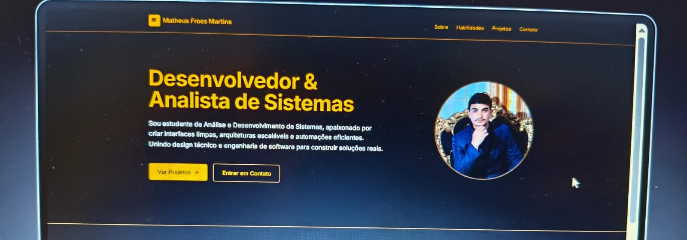
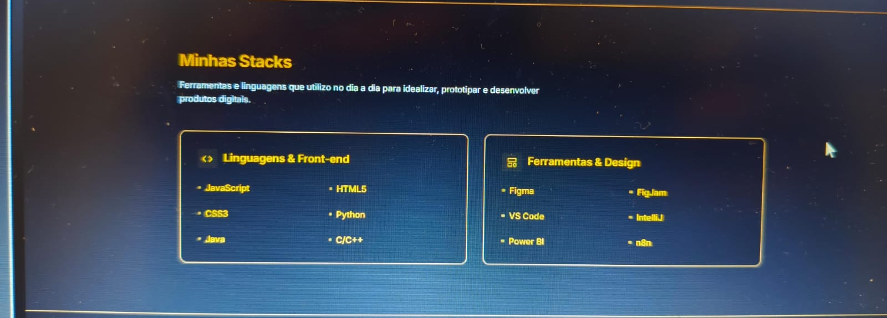
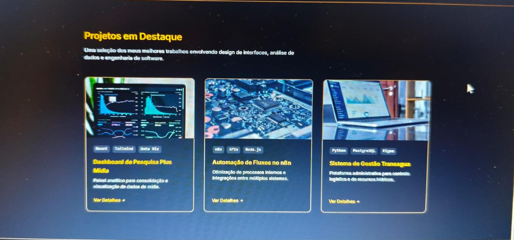

# 🚀 Portfólio Pessoal - UI Design no Figma

Aluno: Matheus Froes Martins
Turno: Matutino
Disciplina: Front-end / Design de Experiência

## 🔗 Link do Protótipo no Figma
> [Clique aqui para acessar o projeto no Figma](https://www.figma.com/make/bUXTLLaWhTcwdJgzDccHIK/Portf%C3%B3lio-Pessoal-de-Desenvolvedor?t=kgfEnNya3trJnLJg-1&preview-route=%2F%23sobre)

## 📱 Telas do Projeto

1. Home / Página Principal

2. Detalhes do Projeto

3. Complemento

